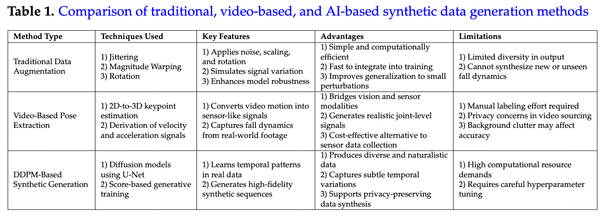

<div align="center">

# 📌 SmartFall – Watch-based Application to Detect Falls


🔗 [Visit Project Website](https://smartfall.github.io/) | [Paper01](https://dl.acm.org/doi/abs/10.1145/3428666) | [Paper02](https://pubmed.ncbi.nlm.nih.gov/35972790/)

<br>

&copy; 2025 SmartFall Research Team. All rights reserved.

</div>


## 📚 Table of Contents

- [SmartFall Ecosystem](#overview)
    - [Key Features](#key_features)
    - [Default Model](#default_model)
        - [Example: Convert a Keras Model to TFLite](#covnert_model_tflite)
    - [Folder Organization](#folder_organization)
- [Prerequisites](#prerequisites)
- [Offline Data Storage](#offline-data-storage)
- [Adding a New Sensor](#adding-a-new-sensor)
- [Replacing or Updating the Machine Learning Model](#replacing-or-updating-the-machine-learning-model)
- [Troubleshooting](#troubleshootingabc)
- [Citation](#citation)

<a name="overview"></a>
## 🚀 SmartFall Ecosystem - Overview

<p align="center">  </p>

**SmartFall** is an Android-based system for real-time fall detection and personalized health monitoring, powered by on-device machine learning using wearable IMU sensors. The <b>smartwatch/wear</b> independently handles sensing, inference, labeling, and communication, while the <b>smartphone/app</b> serves only for initial user registration and configuration.

<a name="key_features"></a>
### 🧠 Key Features

- **Smartwatch-Centric Architecture**: All core functionalities, including sensor recording, real-time prediction, user prompting, and data preparation, are handled directly on the WearOS watch.
- **Minimal Phone Involvement**: The phone is only used to register the user and remotely activate or configure data recording on the watch via BLE.
- **On-Watch Intelligence**: Real-time fall detection runs locally using TensorFlow Lite models without needing cloud connectivity.
- **User-Guided Labeling**: The watch prompts the user after a detected event to confirm and label it, enabling personalized learning.
- **End-to-End Data Pipeline**: Labeled data is organized and transmitted from the watch over WiFi for storage and retraining.
- **Personalized Model Updates**: External infrastructure analyzes uploaded data, retrains the model, and syncs it back to the watch for personalized inference.


> 📘 **Refer to** the full technical documentation [smartfall_ecosystem_2025.pdf](pdfs/smartfall_ecosystem_2025.pdf) for:
> - System installation and setup  
> - Daily workflow and app usage  
> - Smartwatch operation details  
> - Retrieving sensed data from Couchbase

<a name="default_model"></a>
### 🧠 Default Model

SmartFall includes a pre-trained deep learning model for real-time fall detection, optimized for on-device inference.

- The model uses only **accelerometer data**, formatted as sequences of shape `(1, 128, 3)` — where `128` is the window size and `3` represents the `x, y, z` axes.
- It was trained using a `window size of 128` and a `step size of 10`, capturing fine-grained temporal motion features.
- The model was trained with standard deep learning parameters and then converted into **TensorFlow Lite (TFLite)** format for deployment.
- The TFLite model is placed in the `assets/` folder of the `wear/` app, enabling efficient, offline inference directly on the smartwatch.

This default model enables out-of-the-box fall detection and serves as the starting point for later personalization using user-labeled data.

<a name="covnert_model_tflite"></a>
#### 🔄 Example: Convert a Keras Model to TFLite

You can convert a trained Keras model (`.h5`) to TensorFlow Lite format using the following code:

```python
import tensorflow as tf

# Load the trained model
## Works if you saved the model using: model.save('fall_model.h5')>
model = tf.keras.models.load_model('fall_model.h5') 

# Convert the model to TensorFlow Lite format
converter = tf.lite.TFLiteConverter.from_keras_model(model)
converter.optimizations = [tf.lite.Optimize.DEFAULT]
tflite_model = converter.convert()

# Save the converted model
with open('fall_model.tflite', 'wb') as f:
    f.write(tflite_model)
```

<a name="folder_organization"></a>
### 📁 Folder Organization

The project is organized as follows:

```
SmartFall-Multi-Model-Watch-main/
├── .gradle/                   # Gradle build system files (auto-generated)
├── PHP-Scripts/               # Backend PHP scripts for syncing data via tunnel
├── app/                       # Android phone app (used only for user registration and BLE-based control)
├── gradle/wrapper/            # Gradle wrapper configuration
├── images/                    # Project-related images for documentation
├── pdfs/                      # System architecture and usage documentation
├── wear/                      # WearOS smartwatch app (core logic)
│   ├── src/                   # Java source code and activity classes
│   ├── res/                   # Layouts, drawables, and other UI resources
│   ├── assets/                # TensorFlow Lite models and configuration files
│   └── AndroidManifest.xml    # Watch app manifest file
│
├── README.md                  # Project overview and usage instructions
├── build.gradle               # Top-level Gradle build file
├── gradle.properties          # Gradle configuration settings
├── gradlew                    # Unix shell script for running Gradle
├── gradlew.bat                # Windows batch script for running Gradle
├── settings.gradle            # Gradle project settings
```
> 📝 Note: The watch app manages all core operations: IMU data recording, ML inference, event labeling, and data syncing. The phone app is only used for initial user registration and activating sensors via BLE.

<a name="prerequisites"></a>
## 🔧 Prerequisites

- **Java Development Kit (JDK)**: Version **18** or later  
- **Android Studio**: Version **Giraffe (2022.3.1)** or later  
- **WearOS-compatible smartwatch** and **Android phone** with ADB access enabled


<a name="offline-data-storage"></a>
## 🗃️ Offline Data Storage (without Couchbase)

If Couchbase is not configured or the server is unreachable, SmartFall stores sensor and label data locally on the watch as JSON files. These files are saved in the internal app storage or external directory (e.g., `/sdcard/SmartFall/`). You can retrieve them using ADB:

```bash
adb shell ls /sdcard/SmartFall/
adb pull /sdcard/SmartFall/<filename>.json
```

For internal storage, run:
```bash
adb shell run-as com.example.smartfallwatch cat files/<filename>.json > output.json
```
Each file contains timestamped IMU data, predictions, confidence scores, and user labels for offline analysis.

<a name="adding-a-new-sensor"></a>
## 🧪 Adding a New Sensor (e.g., Gyroscope)

If your fall detection model is trained to accept **two separate input tensors** (e.g., one for accelerometer, one for gyroscope), follow these steps to integrate it into the SmartFall app:

1. **Register** both Sensors in `SensorService.java` file in `onStartCommand()`:
    ```java
    sensorManager.registerListener(this,
        sensorManager.getDefaultSensor(Sensor.TYPE_ACCELEROMETER),
        SensorManager.SENSOR_DELAY_FASTEST);

    sensorManager.registerListener(this,
        sensorManager.getDefaultSensor(Sensor.TYPE_GYROSCOPE),
        SensorManager.SENSOR_DELAY_FASTEST);
    ```

2. **Buffer Both Sensor Streams Separately:** In `onSensorChanged()`, maintain two synchronized buffers (e.g., `accBuffer`, `gyroBuffer`) with timestamps:
    ```bash
    if (event.sensor.getType() == Sensor.TYPE_ACCELEROMETER) {
        accBuffer.add(new float[]{event.values[0], event.values[1], event.values[2]});
    }
  
    if (event.sensor.getType() == Sensor.TYPE_GYROSCOPE) {
        gyroBuffer.add(new float[]{event.values[0], event.values[1], event.values[2]});
    }
    ```
    Make sure both buffers are aligned to the same time window (e.g., 2 seconds with overlapping frames).

3. **Prepare Dual Input for TFLite Inference:** In your prediction module (`PredictionContext.java` or similar), convert both buffers into `ByteBuffer` or `TensorBuffer` objects:
    ```
    tflite.runForMultipleInputsOutputs(new Object[]{accTensor, gyroTensor}, outputMap);
    ```
    Ensure the model’s input shapes match the expected window dimensions (e.g., `[1, 128, 3]` for each sensor).

4. **Store and Upload Dual-Sensor Data:** Update local JSON logging and upload formatting to include both sensor streams:
    ```java
    {
      "uuid": "abc123",
      "acc": [[...], [...], ...],
      "gyro": [[...], [...], ...],
      "label": "fall",
      "confidence": 0.92,
      "timestamp": 1719370000000
    }
    ```
5. **Update PHP and Couchbase Storage (Optional):** If uploading to Couchbase, ensure `upsertdocuments.php` accepts and parses both `acc` and `gyro` arrays.

> ⚠️ Make sure to retrain or validate the model with your dual-sensor data structure before converting it into a `.tflite` format and deploying it.

<a name="replacing-or-updating-the-machine-learning-model"></a>
## 🔁 Replacing or Updating the Machine Learning Model

To update the machine learning model used by SmartFall, follow these steps:

1. **Train and Export Your Model:** Train your fall detection model using your preferred framework (e.g., TensorFlow) and export it as a `.tflite` file. Ensure the model:
    - Accepts the same input shape expected by the app (e.g., accelerometer-only or dual-stream with gyroscope).
    - Produces classification probabilities or labels compatible with the app’s output processing.

2. **Replace the Model File:** If you are using local inference (non-cloud), locate the configuration file in wear (e.g., `wear > java > com.example.wear > config > SmartFallConfig.java`). Update the following field to point to your model file:
    ```bash
    public static final String MODEL_NAME = "your_model.tflite";
    ```
    Place your `.tflite` file in the following directory `wear > assets`. Make sure the filename exactly matches the one set in `MODEL_NAME`.

3. **For Cloud-Based Model Download:** If you are using a cloud-based deployment, upload your `.tflite` file to the server specified in `getCloudConfig().downloadModel`.
    The watch will fetch and use this model dynamically at runtime. Ensure the server is configured to serve the correct `.tflite` file when requested.

> ✅ No Java code modification is needed beyond changing the filename in the config.


<a name="troubleshootingabc"></a>
## 🛠️ Troubleshooting

The following are the common issues while running the project:
- If the phone stops transmitting data, you will see “OFF” instead of the data transmitting after clicking Activate. In this case, go to WearOS on the smartphone, please unpair the watch, and pair both the phone and watch again. Make sure you uninstall the app on your phone and watch both before repairing.
- If you can not see the watch in Android Studio, turn off the ADB debugging and turn it on again.
- When you are tracking the prediction values in the log in Android Studio. 
- Sometimes the prediction value can go high. Typically, it should be between 0 and 1. If it is increasing over time, that means the model has not been loaded properly. Try to do it again from the beginning and run it again on the smartphone.

<a name="citation"></a>
## 📚 Citation

If you use or reference this system in your work, please cite the following papers:

> Taylor Mauldin, Anne H. Ngu, Vangelis Metsis, and Marc E. Canby. 2021. Ensemble Deep Learning on Wearables Using Small Datasets. ACM Trans. Comput. Healthcare 2, 1, Article 5 (January 2021), https://doi.org/10.1145/3428666
```text
@article{10.1145/3428666,
  author = {Mauldin, Taylor and Ngu, Anne H. and Metsis, Vangelis and Canby, Marc E.},
  title = {Ensemble Deep Learning on Wearables Using Small Datasets},
  year = {2021},
  issue_date = {January 2021},
  publisher = {Association for Computing Machinery},
  address = {New York, NY, USA},
  volume = {2},
  number = {1},
  url = {https://doi.org/10.1145/3428666},
  doi = {10.1145/3428666},
  journal = {ACM Trans. Comput. Healthcare},
  month = December,
  articleno = {5},
  numpages = {30}
}
```

> Ngu AH, Metsis V, Coyne S, Srinivas P, Salad T, Mahmud U, Chee KH. Personalized Watch-Based Fall Detection Using a Collaborative Edge-Cloud Framework. Int J Neural Syst. 2022 Dec;32(12):2250048. doi: 10.1142/S0129065722500484. Epub 2022 Aug 15. PMID: 35972790.
```text
@article{Ngu2022FallDetection,
  author    = {Ngu, Anne Hee and Metsis, Vangelis and Coyne, Shuan and Srinivas, Priyanka and Salad, Tarek and Mahmud, Uddin and Chee, Kyong Hee},
  title     = {Personalized Watch-Based Fall Detection Using a Collaborative Edge-Cloud Framework},
  journal   = {International Journal of Neural Systems},
  volume    = {32},
  number    = {12},
  pages     = {2250048},
  year      = {2022},
  doi       = {10.1142/S0129065722500484},
  url       = {https://doi.org/10.1142/S0129065722500484},
  eprint    = {https://europepmc.org/article/MED/35972790},
  publisher = {World Scientific},
  note      = {Epub 2022 Aug 15},
  pmid      = {35972790}
}
```

